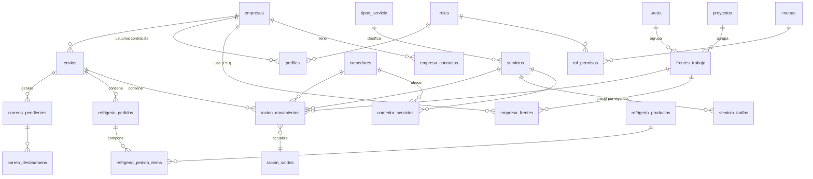

# Modelo de datos — Portal de Raciones Kuntur Wasi

**Fase 0 · Borrador para aprobación · 05/10/2026**

Base de datos PostgreSQL en Supabase. Reglas comunes a todas las tablas:

- Clave `id uuid` (salvo catálogos pequeños con código), `created_at`, `updated_at`, `created_by`.
- **RLS activo.**
- Borrado lógico con `activo boolean` en catálogos.
- Nombres en español y `snake_case`.
- Textos de catálogo **normalizados**: sin espacios al inicio ni al final, en mayúsculas. Los datos actuales tienen variantes como `KM 52 ` o `LAQUINUA `.

## 1. Diagrama principal

## 2. Organización

| Tabla | Columnas principales | Notas |
|---|---|---|
| `empresas` | `ruc char(11) unique`, `razon_social`, `nombre_corto`, `direccion`, `tipo` (empresa / persona), `telefonos text`, `activo`, `origen_id` | Origen: `MAESTRO DE CLIENTES` (177 filas). Validar el RUC con dígito verificador. El teléfono hoy es texto libre con varios números: se guarda tal cual |
| `empresa_contactos` | `empresa_id`, `tipo` (gestion_raciones / facturacion / cobranzas), `nombre`, `telefono`, `correo`, `recibe_notificaciones boolean` | Origen: `MAESTRO DE CONTACTOS` (653 filas, de 1 a 12 por empresa). Reemplaza a `empresa_correos_notificacion`: los contactos marcados reciben los correos (máximo 5) **[PREGUNTA P20]** |
| `proyectos` | `codigo`, `nombre`, `activo` | YANACOCHA, QUETCHER, WTP + **SULFUROS**, que se usa en los datos pero falta en el maestro |
| `areas` | `nombre`, `activo` | 43 + **OPERACIONES AGUA**, que se usa pero falta en el maestro |
| `frentes_trabajo` | `proyecto_id`, `area_id`, `nombre` (= "proyecto menor" o "PY valorización"), `sponsor`, `contrato_desde`, `contrato_hasta`, `activo` | Origen: `MAESTRO DE PROYECTO - CLIENTE` (263 filas). Único por (proyecto, área, nombre). El mismo nombre se repite en distintas áreas (54 casos) |
| `empresa_frentes` | `empresa_id`, `frente_id`, `contrato_desde`, `contrato_hasta` | Qué frentes puede usar cada empresa. Se llena en el registro y desde el historial **[PREGUNTA P10]** |

## 3. Comedores y servicios

| Tabla | Columnas | Notas |
|---|---|---|
| `sectores` | `codigo` (PARTE_ALTA, PARTE_BAJA, BARRACAS), `nombre` | Hoy es la columna `TIPO_COMEDOR`; vacía en 21 comedores |
| `comedores` | `nombre`, `sector_id`, `activo`, `habilitado_raciones`, `habilitado_refrigerios`, `habilitado_puntos_k`, `habilitado_kitchenette` | 34 comedores. Solo 13 tienen raciones en el historial. Los flags de puntos K y kitchenette se guardan aunque esos módulos no estén en alcance |
| `tipos_servicio` | `codigo` (DESAYUNO, ALMUERZO, CENA) | Base de la regla de traslados |
| `servicios` | `nombre`, `tipo_servicio_id`, `es_a_campo boolean`, `orden`, `activo` | 10 servicios |
| `servicio_tarifas` | `servicio_id`, `precio numeric(10,2)`, `vigente_desde date`, `vigente_hasta date` | 124 filas. Sin solapes, garantizado con una restricción `EXCLUDE` de rango de fechas. Moneda S/, ¿sin IGV? **[PREGUNTA P12]** |
| `comedor_servicios` | `comedor_id`, `servicio_id`, `activo` | No existe hoy. Carga inicial deducida del historial, para revisión **[PREGUNTA P9]** |
| `traslado_reglas_servicio` | `servicio_origen_id`, `servicio_destino_id` | Opcional: excepciones a la regla "mismo tipo de servicio" |
| `traslado_reglas_sector` | `sector_origen_id`, `sector_destino_id` | Matriz configurable. Valor inicial: cada sector solo consigo mismo [P8] |

## 4. Raciones (núcleo)

| Tabla | Columnas | Notas |
|---|---|---|
| `envios` | `id`, `empresa_id`, `usuario_id`, `tipo` (programacion / adicion_reduccion / traslado / refrigerio / migracion), `clave_idempotencia uuid unique`, `enviado_en timestamptz default now()`, `total_filas`, `total_raciones`, `fuera_de_plazo boolean`, `motivo_excepcion text` | Una fila por cada clic en "Enviar" |
| `racion_movimientos` | `id`, `envio_id`, `empresa_id`, `fecha date`, `frente_id`, `comedor_id`, `servicio_id`, `tipo_movimiento` (programacion / adicion / reduccion / traslado_salida / traslado_entrada), `cantidad int` (con signo, ≠ 0), `traslado_par_id uuid null`, `origen_id` | Inmutable: no se edita ni se borra. Unos 160.000 por año. Índices: `(empresa_id, fecha)`, `(fecha, comedor_id, servicio_id)`. El proyecto y el área salen del frente |
| `racion_saldos` | PK `(empresa_id, fecha, frente_id, comedor_id, servicio_id)`, `cantidad int` | Se actualiza en la misma transacción. `CHECK (cantidad >= 0)`: verifiqué que ninguna de las 247.798 combinaciones históricas queda en negativo. Lo usan el dashboard, la consulta y las validaciones |
| `borradores` | `usuario_id`, `empresa_id`, `modulo`, `filas jsonb`, `updated_at` | Grilla de previsualización persistente |

**Validación al enviar** (función `enviar_raciones(...)`, `SECURITY DEFINER`, en una transacción):

1. Revisa sesión, rol, alcance y permiso.
2. Revisa idempotencia: si la clave ya existe, devuelve el envío existente.
3. Revisa plazos con `now()` en la zona configurada, salvo que el usuario tenga el permiso de excepción y dé un motivo.
4. Revisa catálogos: el comedor ofrece el servicio, el frente está habilitado para la empresa y el contrato está vigente en esa fecha (P10).
5. `SELECT … FOR UPDATE` sobre los saldos afectados; reducciones y traslados nunca dejan un saldo menor que 0.
6. Inserta el envío, los movimientos, los saldos, la auditoría y el correo pendiente.

## 5. Refrigerios

| Tabla | Columnas | Notas |
|---|---|---|
| `refrigerio_productos` | `nombre`, `unidad`, `activo` | Datos de ejemplo; el Superadmin los gestiona [P2] |
| `refrigerio_producto_precios` | `producto_id`, `precio_sin_igv`, `vigente_desde`, `vigente_hasta` | Precio con vigencia, igual que los servicios |
| `refrigerio_estandar` | `nombre`, `precio_sin_igv`, `vigente_desde`, `vigente_hasta` | Hoy S/ 29,78 |
| `refrigerio_estandar_items` | `estandar_id`, `producto_id`, `cantidad` | 2 sándwich, 1 gaseosa, 2 fruta, etc. |
| `refrigerio_turnos` | `hora time`, `etiqueta`, `activo` | 9:30 am, 11:30 am, 6:00 pm, … entre 06:00 y 21:30 |
| `refrigerio_pedidos` | `envio_id`, `empresa_id`, `fecha`, `comedor_id`, `turno_id`, `tipo` (estandar / especial / estandar_mas_especial), `cantidad int`, `encargado text`, `precio_unitario_sin_igv`, `total_sin_igv`, `estado` | Una fila por día, como en el correo |
| `refrigerio_pedido_items` | `pedido_id`, `producto_id`, `cantidad_por_refrigerio`, `precio_unitario_sin_igv` | Composición congelada al enviar |
| `refrigerio_movimientos` | `pedido_id`, `tipo` (reduccion / anulacion), `cantidad`, `envio_id` | Depende de **P15** |

## 6. Usuarios, roles y permisos

| Tabla | Columnas | Notas |
|---|---|---|
| `perfiles` | `id = auth.users.id`, `nombre`, `correo`, `rol_id`, `empresa_id null`, `comedor_id null`, `estado` (pendiente / activo / inactivo), `debe_cambiar_password`, `ultimo_acceso` | La contraseña la guarda solo Supabase Auth, cifrada |
| `roles` | `codigo`, `nombre`, `alcance` (empresa / todas / comedor), `es_sistema` | Los 5 roles base no se pueden borrar |
| `menus` | `codigo`, `padre_codigo`, `nombre`, `icono`, `ruta`, `orden` | Árbol menú → pestaña |
| `rol_permisos` | `rol_id`, `menu_codigo`, `acciones text[]` (ver, crear, enviar, exportar, aprobar) | "Saltar horario" no es un permiso asignable: lo tiene solo el rol Superadmin [P5] |
| `solicitudes_registro` | `ruc`, `razon_social`, `direccion`, `frentes jsonb`, `contactos jsonb`, `correo_usuario`, `estado`, `revisado_por`, `motivo_rechazo`, `tyc_version_id` | |

## 7. Contenido, correo y sistema

| Tabla | Notas |
|---|---|
| `documentos` (`tipo`: menu_semanal_1, menu_semanal_2, manual, terminos; `version`, `ruta_storage`, `tamano`, `vigente`) | PDF en bucket privado |
| `alertas`, `alertas_vistas` | Popup post-login |
| `plantillas_correo` (`codigo`, `asunto`, `html`, `texto`) | Se cargan desde los 4 modelos del Word |
| `correos_pendientes` (`envio_id`, `plantilla`, `datos jsonb`, `html_final`, `estado`, `intentos`, `proximo_intento`) | Outbox |
| `correo_destinatarios` (`correo_id`, `correo`, `tipo` to/cc/bcc, `estado`, `ses_message_id`, `detalle`) | Estado por destinatario |
| `mensajes_contacto`, `mensaje_adjuntos` | Contáctanos |
| `configuracion` (clave/valor tipado), `config_horarios` (`modulo`, `regla`, `valor jsonb`) | |
| `auditoria` (`usuario_id`, `empresa_id`, `modulo`, `accion`, `entidad`, `entidad_id`, `antes jsonb`, `despues jsonb`, `ip`, `en`) | Solo inserción. Particionada por mes si crece |
| `importaciones`, `importacion_errores` | Importador |

## 8. Volumen esperado

| Dato | Valor |
|---|---|
| Movimientos de raciones (histórico ene-2025 a dic-2026) | 320.163 |
| Movimientos por año | ~160.000 |
| Envíos estimados | ~1.200 al mes, hasta 505 filas por envío |
| Catálogos | < 1.000 filas cada uno |

Con estos volúmenes y los índices indicados, el plan Free de Supabase sirve para desarrollo y el Pro para producción.
